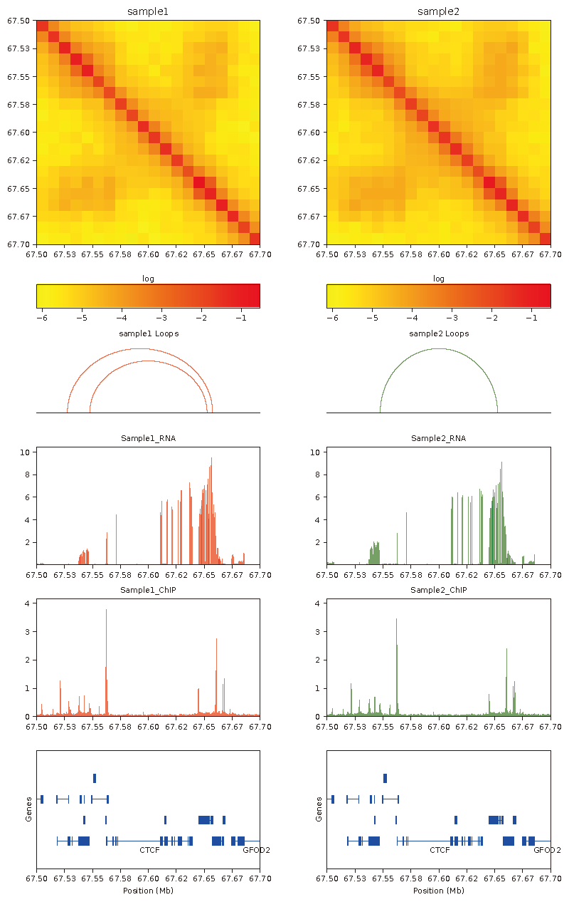
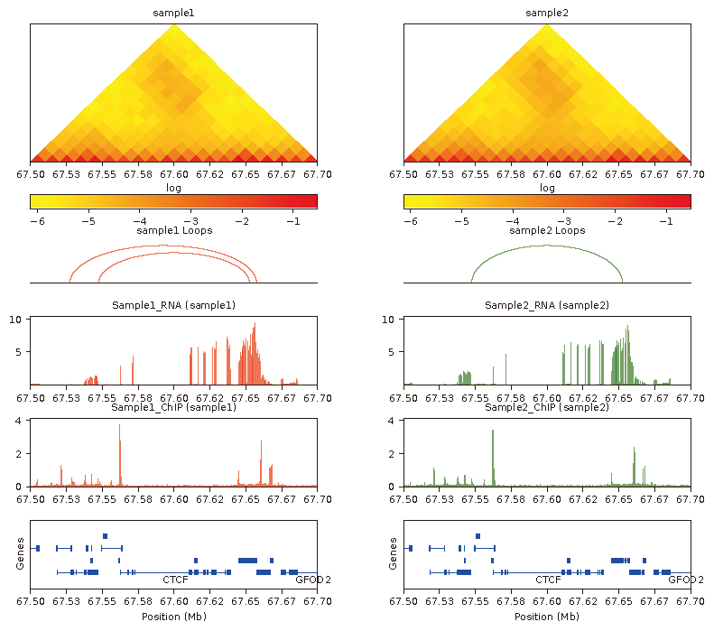
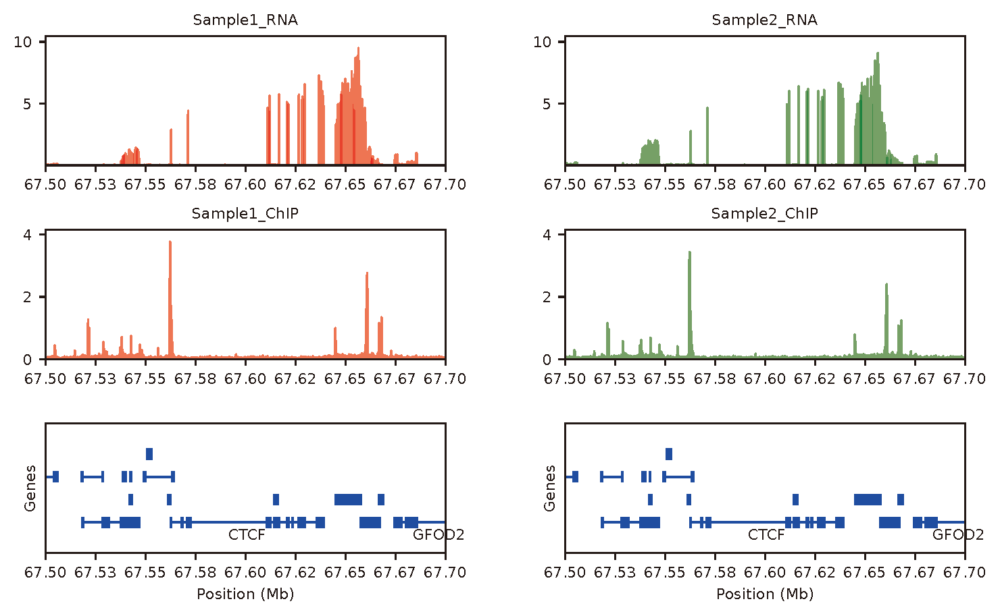

# HiCPlot  

### HiCPlot can be used to plot square and triangle heatmaps from Hi-C matrices and tracks from bigwig files.  

#### plot square heatmaps for individual/two Hi-C contact matrices
the format of input file is cool format.  
the output file is heatmaps and genome tracks.  
#### usage:
``` 
    SquHeatmap \
    --cooler_file1 "sample1.mcool" \
    --cooler_file2 "sample2.mcool" \
    --sampleid1 "sample1" --sampleid2 "sample2" \
    --bigwig_files_sample1 "sample1.bw" \
    --bigwig_labels_sample1 "sample1 RNAseq" \
    --colors_sample1 "red" \
    --bigwig_files_sample2 "sample2.bw" \
    --bigwig_labels_sample2 "sample2 RNAseq" \
    --colors_sample2 "green" \
    --gtf_file "gencode.v38.annotation.gtf" \
    --resolution 10000 --chrid "chr16" --start 67500000 --end 67700000 \
    --cmap "autumn_r" --layout 'horizontal' \
    --output_file "Square_horizontal_heatmap.pdf" \
    --track_size 4 \
    --track_spacing 0.5 \
    --normalization_method "log"
```
**Square and Horizontal Heatmap**  



#### plot triangle heatmaps for individual/two Hi-C contact matrices
#### usage: 
``` 
    TriHeatmap \
    --cooler_file1 "sample1.mcool" \
    --cooler_file2 "sample2.mcool" \
    --sampleid1 "sample1" --sampleid2 "sample2" \
    --bigwig_files_sample1 "sample1.bw" \
    --bigwig_labels_sample1 "sample1 RNAseq" \
    --colors_sample1 "red" \
    --bigwig_files_sample2 "sample2.bw" \
    --bigwig_labels_sample2 "sample2 RNAseq" \
    --colors_sample2 "green" \
    --gtf_file "gencode.v38.annotation.gtf" \
    --resolution 10000 --chrid "chr16" --start 67500000 --end 67700000 \
    --cmap "autumn_r" --layout 'horizontal' \
    --output_file "Triangle_horizontal_heatmap.pdf" \
    --track_width 4 \
    --track_height 1.5 \
    --track_spacing 0.5 \
    --normalization_method "log"
``` 
**Triangle and Horizontal Heatmap**  


#### plot square heatmaps for difference betwee two Hi-C contact matrices
the format of input file is cool format.  
the output file is heatmaps and genome tracks.  
#### usage:
``` 
    DiffSquHeatmap \
    --cooler_file1 "sampleq.mcool" \
    --cooler_file2 "sample2.mcool" \
    --bigwig_files_sample1 "sample1.bw" \
    --bigwig_labels_sample1 "sample1 RNAseq" \
    --colors_sample1 "red" \
    --bigwig_files_sample2 "sample2.bw" \
    --bigwig_labels_sample2 "sample2 RNAseq" \
    --colors_sample2 "green" \
    --gtf_file "/data/bxhu/project/database/hg38/gencode.v38.annotation.gtf" \
    --resolution 10000 --chrid "chr16" --start 67500000 --end 67700000 \
    --cmap "autumn_r" \
    --output_file "diffSquheatmap.pdf" \
    --track_size 4 \
    --track_spacing 0.5 \
    --operation divide \
    --division_method log2_add1 \
    --diff_cmap bwr --diff_title "log2((sample1+1)/(sample2+1))"
```

**Square division Heatmap**  


#### plot genomic tracks based on bigwig files
#### usage: 
``` 
    NGStrack \
    --chrid "chr16" --start 67500000 --end 67700000 \
    --layout 'horizontal' \
    --track_width 4 \
    --track_height 1.5 \
    --track_spacing 0.5 \
    --bigwig_files_sample1 "/data/bxhu/project/ZZL/RNAseq/bam/bw/HethVEH_10bp.bw" \
    --bigwig_labels_sample1 "sample1 RNAseq" \
    --colors_sample1 "red" \
    --bigwig_files_sample2 "/data/bxhu/project/ZZL/RNAseq/bam/bw/SCAVEH_10bp.bw" \
    --bigwig_labels_sample2 "sample2 RNAseq" \
    --colors_sample2 "green" \
    --gtf_file "/data/bxhu/project/database/hg38/gencode.v38.annotation.gtf" \
    --output_file "track_horizontal.pdf"
```
**Horizontal Track**  



### Installation 
#### requirement for installation  
python>=3.12  
numpy  
pandas  
argparse  
cooler  
matplotlib  
pyBigWig  
pyranges  

#### pip install HiCPlot==1.0.3
https://pypi.org/project/HiCPlot/1.0.3/  


